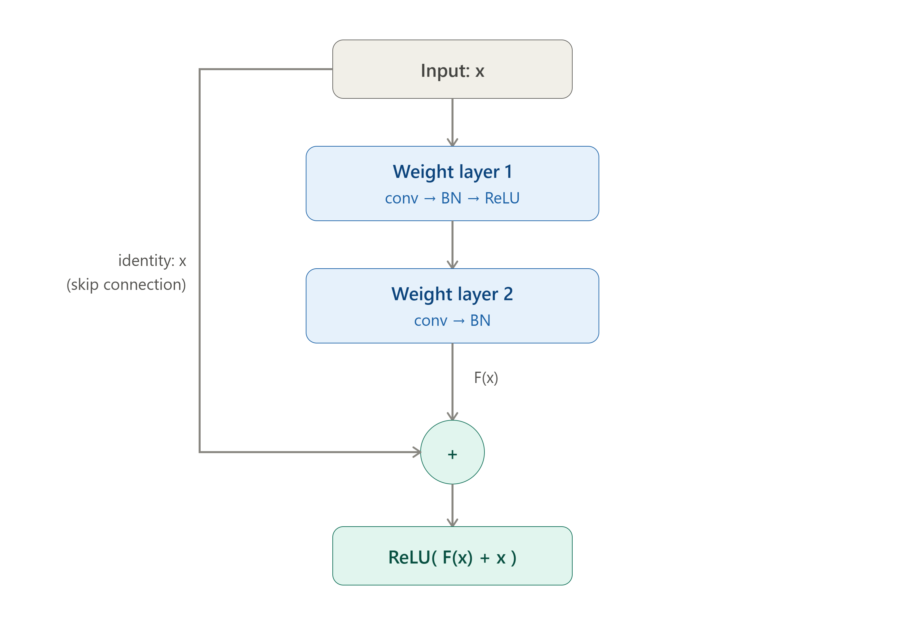

# ResNet

## The problem ResNet was invented to solve

Before ResNet (2015), there was a puzzle. Intuitively, a deeper network should never be *worse* than a shallower one — the extra layers could just learn the identity function and pass information through unchanged. So a 56-layer net should match or beat a 20-layer net.

But in practice, the opposite happened. Plain deep networks got **worse** as they got deeper — and critically, not just on test data (which would mean overfitting) but on **training** data too. That's the tell: it's not an overfitting problem, it's an **optimization** problem. The network *couldn't* learn the identity mapping through a stack of nonlinear layers, even though that mapping existed. This is called the **degradation problem**.

## The core insight

Instead of asking a stack of layers to learn the full desired mapping $H(x)$ directly, ResNet reframes the task. Let the layers learn the **residual**:

$$F(x) = H(x) - x \quad\Longrightarrow\quad H(x) = F(x) + x$$

That `+ x` is the **skip connection** (also called shortcut or identity connection). The layers now only have to learn *the difference* between the input and the desired output.

### Why is this easier?

If the optimal thing to do is "leave the input alone" (identity), the network just has to push $F(x) \to 0$ — driving weights toward zero is easy for gradient descent. Learning an exact identity mapping through nonlinear conv+ReLU layers is hard. Learning "output nothing" is trivial.

Let me show you the building block visually:Here's the fundamental residual block:

Notice the two paths: the **main path** (through the weight layers) computes $F(x)$, and the **shortcut path** carries $x$ across unchanged. They meet at the addition, then a final ReLU is applied.

## Why this fixes the gradient flow

This is the interview-critical part. Consider the output of a block: $y = F(x) + x$. Look at what happens during backpropagation. The gradient of the loss with respect to the input is:

$$\frac{\partial L}{\partial x} = \frac{\partial L}{\partial y}\left(1 + \frac{\partial F}{\partial x}\right)$$

That `1` is everything. In a plain deep network, the gradient at layer $x$ is a long product of terms $\frac{\partial F}{\partial x}$ — and when many of those terms are small (< 1), the product shrinks toward zero as it propagates back through layers. That's the **vanishing gradient** problem: early layers get almost no learning signal.

With the residual connection, the gradient is $\frac{\partial L}{\partial y} \cdot (1 + \text{something})$. Even if $\frac{\partial F}{\partial x}$ is tiny, the gradient still has a clean, unattenuated path back through the `+1`. It's often described as a **gradient highway** — the loss signal can flow directly from deep layers to shallow ones without being repeatedly multiplied down. This is what lets ResNet train networks 50, 101, even 152 layers deep, where plain networks fall apart.

## Handling dimension changes

One practical wrinkle: the addition $F(x) + x$ only works if $F(x)$ and $x$ have the **same shape**. When a block changes the number of channels or downsamples spatially (stride 2), the identity shortcut can't be a plain copy. ResNet handles this with a **projection shortcut** — a $1\times1$ convolution on the skip path that reshapes $x$ to match $F(x)$. When dimensions already match, it stays a parameter-free identity (which is cheaper and preferred).

## Two block flavors

This connects to something you've looked at before — the ResNet family uses two block designs:

| Aspect | Basic block | Bottleneck block |
|---|---|---|
| Used in | ResNet-18, ResNet-34 | ResNet-50, 101, 152 |
| Structure | two $3\times3$ convs | $1\times1$ → $3\times3$ → $1\times1$ |
| Purpose of $1\times1$ convs | — | reduce channels, then restore |
| Why | simpler, fewer layers | compute-efficient at depth |

The bottleneck's trick: the first $1\times1$ conv *squeezes* the channel count down (say 256 → 64), the $3\times3$ conv does the expensive spatial work on the cheaper 64-channel tensor, and the last $1\times1$ *expands* back up (64 → 256). Same expressive power, far fewer FLOPs — which is exactly why ResNet-50 became the workhorse backbone for transfer learning.

## The one-sentence version to remember

ResNet lets a layer learn *how to adjust its input* rather than *how to transform it from scratch*, and the skip connection gives gradients a shortcut home — together these make very deep networks trainable.

Want to go deeper on any of these next? Good directions from here: the **pre-activation ResNet-v2** variant (which moves the BN and ReLU around for even cleaner gradient flow), the **bottleneck block internals** in full detail, or a hands-on look at how ResNet-50 gets used as a **fine-tuning backbone**.